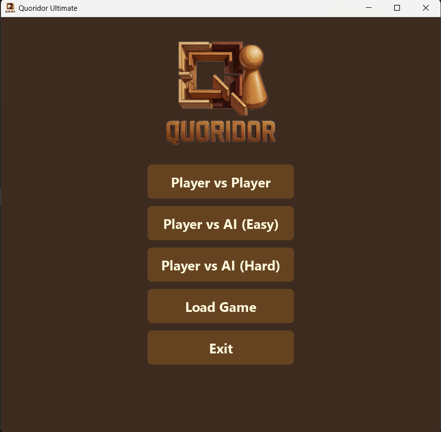
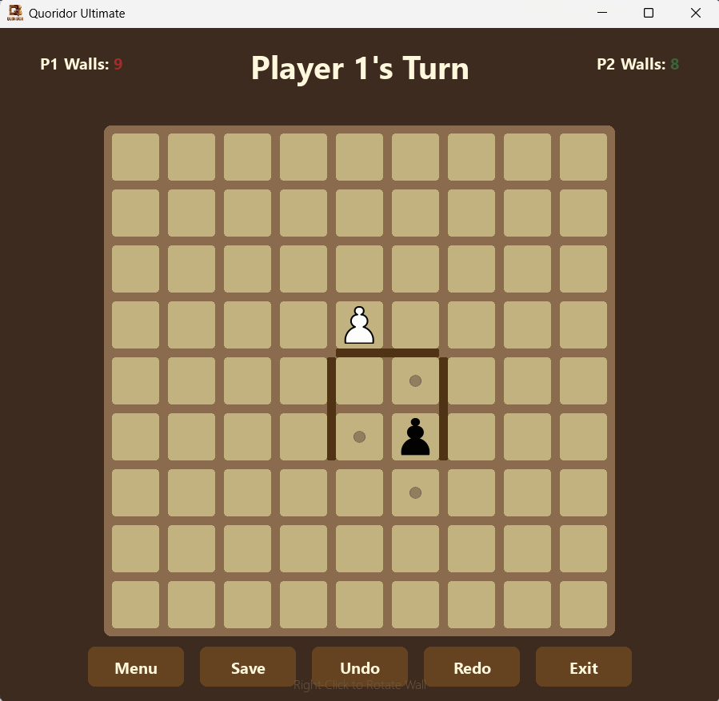

# Quoridor Game Implementation 

[](https://www.python.org/)
[](https://www.pygame.org/)
[](LICENSE)

A robust implementation of the abstract strategy board game **Quoridor**, featuring a "Classic Wood" GUI and a challenging AI opponent powered by Minimax with Alpha-Beta Pruning.

Developed as a Term Project for **CSE472s: Artificial Intelligence** at Ain Shams University.

---

## Game Description

Quoridor is a 2-player strategy game played on a 9x9 grid.
*   **Objective:** Be the first to move your pawn to the opposite side of the board.
*   **The Twist:** On your turn, you can either move your pawn one step OR place a wall to block your opponent.
*   **The Rule:** You cannot completely seal off the opponent's path to the goal; at least one path must always exist.

This project implements the full rule set, including complex path validation (A* Search) and jump mechanics.

### Key Features
*   **Smart AI:** adjustable difficulty (Easy/Hard) using Minimax algorithm, Alpha-Beta pruning, and iterative deepening.
*   **Pathfinding:** Uses A* search to validate wall placements in real-time.
*   **Save/Load System:** Serialize game state to pick up where you left off.
*   **Undo/Redo:** Optimized memory management for move history.

---

## Screenshots

| Main Menu | Gameplay |
|:---:|:---:|
|  |  |

<p align="center">
  <em>Figure 1: The "Classic Wood" theme implementation.</em>
</p>

---

## Demo Video

Watch the AI in action and see the game features demonstrated here:

**[▶️ Watch Quoridor AI Demo](https://drive.google.com/file/d/1a6Sz4ih__k6D093I-ygJLlzZjT473kGv/view?usp=sharing)**

---

## Installation and Running

### Prerequisites
*   Python 3.8 or higher
*   `pip` (Python package manager)

### Steps

1.  **Clone the Repository**
    ```bash
    git clone https://github.com/mohamed-khaledd/Quoridor-Game-Implementation.git
    cd Quoridor-Game-Implementation
    ```

2.  **Install Dependencies**
    ```bash
    pip install -r requirements.txt
    ```

3.  **Run the Game**
    ```bash
    python main.py
    ```
    
---

## Controls

The game is primarily mouse-driven for ease of use.

| Action | Control |
| :--- | :--- |
| **Move Pawn** | **Left-Click** on a highlighted adjacent cell. |
| **Place Wall** | Hover over a groove and **Left-Click** to place. |
| **Rotate Wall** | **Right-Click** while hovering a wall to switch between Horizontal/Vertical. |
---

## AI Architecture (Brief)

*   **Search Algorithm:** Minimax with Alpha-Beta Pruning.
*   **Heuristic Evaluation:** Considers Manhattan distance to goal and relative wall advantage.
*   **Optimization:** Transposition tables and selective wall generation to prune the search space.

---

## Contributors

*   **Ahmed Haitham** (ID: 2101629)
*   **Mohamed Khaled** (ID: 2100675)
*   **Marwan Ahmed** (ID: 2100902)

---

*December 2025*

